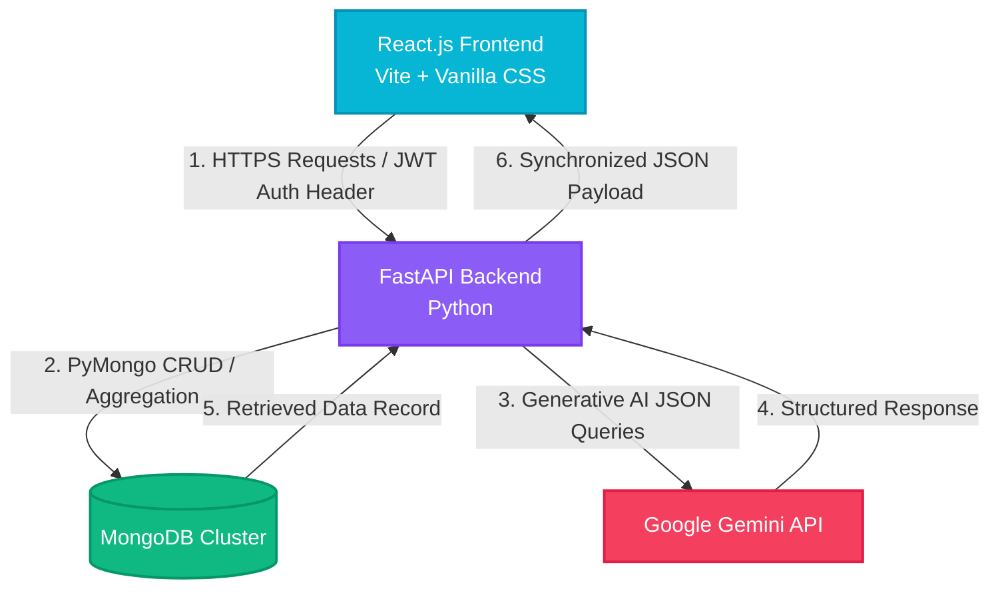

# 🎓 StudyAI: AI-Powered Personal Tutor & Learning Coach
## Comprehensive Project & Technical Design Report

---

## 1. Executive Summary

**StudyAI** is a feature-rich, full-stack educational web application designed to act as an adaptive, personal AI tutor and learning assistant. Modern classrooms and online courses are often criticized for their "one-size-fits-all" approach, leaving students struggling to get targeted help, personalized curriculum paths, and customized learning tools. 

StudyAI solves this problem by integrating advanced large language models (LLMs) from Google’s Gemini family with a modern web application stack to provide:
1. **Specialized Tutor Personas:** Custom conversational experiences modeled after subject matter experts (Sigma for Math, Newton for Science, Athena for History, Ada for Software Engineering, and a General Socratic Tutor).
2. **Dynamic Study Decks & Quizzes:** On-the-fly generation of study resources (flashcards with 3D animation, graded quizzes with detailed tutor critiques) matching student-specified difficulty levels and topics.
3. **Adaptive Learning Intelligence Engine:** A module capable of mapping knowledge graphs (mind maps), detailing custom study roadmaps, conducting diagnostic tests on historical performance, and generating post-chat session summaries.
4. **Secure Data Architecture:** Standard user accounts authenticated via JSON Web Tokens (JWT) and encrypted with bcrypt, supporting a robust horizontal database design utilizing **MongoDB Sharding** alongside a zero-setup **Local Guest Mode** fallback.

---

## 2. System Architecture & Tech Stack

StudyAI utilizes a decoupled client-server architecture. The frontend, written in **React.js** and styled with modular, premium **Vanilla CSS**, communicates asynchronously via HTTPS and JSON payloads with a **FastAPI** Python server. The backend retrieves student records and session progress from a high-performance **MongoDB** database cluster or falls back to server memory if the database is offline.



### 2.1 Technology Stack Matrix

| Layer | Technology | Version / Specification | Rationale |
| :--- | :--- | :--- | :--- |
| **Frontend Framework** | **React.js** | `^19.2.6` (Vite Bundler) | Offers reactive UI state synchronization, hot-reloading development speed, and tree-shaking capability for quick bundle sizes. |
| **Frontend Styling** | **Vanilla CSS** | HSL CSS Variable Tokens | Bypasses complex tailwind overhead, allowing highly responsive custom layouts, custom 3D card flips, glassmorphic filters, and micro-animations. |
| **Backend Framework** | **FastAPI** | `>=0.115.0` (Python) | High-performance ASGI framework built on top of Starlette and Pydantic. Supports asynchronous route handlers and automatically compiles interactive OpenAPI Swagger documentation. |
| **Database** | **MongoDB** | `>=4.8.0` (PyMongo) | Flexible NoSQL document model perfectly suited for rich, hierarchical, and nested educational structures (conversations, quiz history lists, node-link structures) without expensive joins. |
| **Generative AI** | **Google Gemini API** | `google-generativeai >= 0.8.0` | Powers subject tutors, roadmaps, evaluations, and mind maps. Leverages JSON schema configuration and rapid token throughput. |
| **Authentication & Cryptography** | **JWT & Bcrypt** | `PyJWT >= 2.8.0` / `bcrypt >= 4.1.3` | Ensures tamper-proof client sessions through JWT verification signatures and secure one-way salted password hashing. |

---

## 3. Database Schema & Scale-Out Architecture

StudyAI is engineered with scalability in mind. The primary database system runs on MongoDB, utilizing a dynamic scaling plan that configures data partitioning (sharding) for enterprise scale, alongside a graceful fallback model for server execution in offline modes.

### 3.1 MongoDB Database Collection Structures

#### Users Collection (`users`)
Stores credentials and signup timestamps:
```json
{
  "user_id": "8f8b030b-0448-4cb7-9755-a6ad5d81b4f4",
  "username": "hammad11248",
  "email": "student@domain.com",
  "password_hash": "$2b$12$R9h/cIPz0gi.UQ...",
  "created_at": "2026-06-10T13:50:00Z"
}
```

#### Sessions Collection (`sessions`)
Represents individual conversational tutor threads:
```json
{
  "session_id": "761a29f8-bca2-48ea-aa23-8c4de91d24c2",
  "title": "Ada Coding Session",
  "personality": "coding",
  "user_id": "8f8b030b-0448-4cb7-9755-a6ad5d81b4f4",
  "created_at": "2026-06-10T13:51:15Z",
  "updated_at": "2026-06-14T13:51:30Z"
}
```

#### Messages Collection (`messages`)
Stores message history linked to specific chat sessions:
```json
{
  "message_id": "5f6c8d7e-9080-496a-a82a-4db519bcf82f",
  "session_id": "761a29f8-bca2-48ea-aa23-8c4de91d24c2",
  "sender": "user", // "user" or "assistant"
  "content": "What is the Big-O time complexity of Mergesort?",
  "timestamp": "2026-06-14T13:51:25Z"
}
```

#### Quizzes Collection (`quizzes`)
Tracks dynamic tests and evaluations:
```json
{
  "quiz_id": "902d1d4d-570a-4848-8df0-82a16d8a3be2",
  "topic": "Neural Networks",
  "difficulty": "Medium",
  "user_id": "8f8b030b-0448-4cb7-9755-a6ad5d81b4f4",
  "questions": [
    {
      "question": "What function is commonly used to introduce non-linearity into a neural network?",
      "options": ["Sigmoid", "Linear", "Mean Squared Error", "Binary Cross-Entropy"],
      "correct_option": 0,
      "explanation": "The Sigmoid function introduces a non-linear S-curve output..."
    }
  ],
  "score": 4, // Null if quiz is generated but not yet graded
  "answers": [0, 1, 2, 0, 3], // Stored 0-based answer selection
  "feedback": "### Grade Critique\nExcellent understanding of backpropagation...",
  "created_at": "2026-06-12T10:14:02Z"
}
```

#### Flashcards Collection (`flashcards`)
Stores card decks for active recall:
```json
{
  "set_id": "312c1b2f-762d-45ab-bc81-229ef4023b12",
  "topic": "Organic Chemistry",
  "user_id": "8f8b030b-0448-4cb7-9755-a6ad5d81b4f4",
  "cards": [
    {
      "front": "What functional group is characterized by a carbon double-bonded to an oxygen (C=O)?",
      "back": "A carbonyl group."
    }
  ],
  "created_at": "2026-06-13T09:00:30Z"
}
```

---

### 3.2 Advanced Analytics Aggregation Pipeline

Rather than calling basic queries and manually running arithmetic algorithms in memory, StudyAI offloads resource metrics parsing to the MongoDB database engine using a unified **Aggregation Pipeline** in `backend/database.py` under the `/api/analytics` endpoint:

```python
quiz_pipeline = [
    # Stage 1: Filter collections by user_id to isolate data scope
    {"$match": {"user_id": user_id}},
    
    # Stage 2: Project necessary metrics & compute length of nested arrays
    {
        "$project": {
            "quiz_id": 1,
            "score": 1,
            "num_questions": {"$size": {"$ifNull": ["$questions", []]}}
        }
    },
    
    # Stage 3: Group fields to compute sums, conditional completions, and percentages
    {
        "$group": {
            "_id": None,
            "total_generated": {"$sum": 1},
            "total_completed": {
                "$sum": {"$cond": [{"$ne": ["$score", None]}, 1, 0]}
            },
            "avg_score": {
                "$avg": {
                    "$cond": [
                        {"$and": [{"$ne": ["$score", None]}, {"$gt": ["$num_questions", 0]}]},
                        {"$multiply": [{"$divide": ["$score", "$num_questions"]}, 100]},
                        None
                    ]
                }
            }
        }
    }
]
```

#### Pipeline Stages Rationale:
1. **`$match`**: Filters the documents quickly at the index level to minimize the working set size.
2. **`$project`**: Uses `$size` to count questions dynamically, wrapping it in `$ifNull` to avoid failures on malformed documents.
3. **`$group`**: Performs three vital aggregations in a single pass:
   - Sums all documents (`total_generated`).
   - Evaluates a conditional check (`$cond`) using `$ne` (not equal to null) to count only graded quizzes (`total_completed`).
   - Calculates the mathematical average (`$avg`) of raw scores relative to total questions, multiplied by 100 to yield a percentage.

---

### 3.3 Database Scaling Plan: Horizontal Sharding

To support scaling out to millions of active students, StudyAI includes a dedicated sharding tool (`backend/configure_sharding.py`). By partitioning collections horizontally across multiple physical servers (shards), the database avoids single-node memory and CPU constraints.

```
                  [ Mongos Routing Service ]
                 /            |             \
                /             |              \
     [ Shard A ]         [ Shard B ]          [ Shard C ]
  (Sessions for       (Sessions for        (Messages for
   users A-G)          users H-R)           session UUIDs)
```

#### Sharding Configurations:
1. **Database-Level Sharding:** 
   Enables sharding on the `studyai` database via the routing service.
   ```javascript
   sh.enableSharding("studyai")
   ```
2. **`sessions` Collection Partitioning:**
   Index: `user_id`. Shard Key: `{"user_id": 1}`. 
   - **Rationale:** Ensures that all sessions belonging to a specific student are routed to the same database shard, guaranteeing fast loading times for user dashboards.
3. **`messages` Collection Partitioning:**
   Index: `session_id`. Shard Key: `{"session_id": 1}`. 
   - **Rationale:** Messages can expand indefinitely over long chat conversations. Sharding by `session_id` ensures that full conversational transcripts are read from a single shard during active tutor sessions.
4. **`quizzes` & `flashcards` Collections Partitioning:**
   Index: `user_id`. Shard Key: `{"user_id": 1}`.
   - **Rationale:** Allows fast analytics lookups and aggregates by placing a single user's study records on the same physical shard.

---

## 4. Generative AI Engineering & Fallbacks

StudyAI relies heavily on the Google Gemini API. Integrating commercial generative APIs into a web application introduces two significant engineering challenges: guaranteeing structured outputs (e.g. JSON strings) and ensuring high availability during rate limiting or quota constraints.

### 4.1 Structured JSON Response Strategy

Large Language Models are naturally conversational and often output descriptive preambles (e.g. *"Here is your quiz:"*) or formatting blocks. To prevent application crashes during JSON serialization, StudyAI enforces API response formatting using Gemini's configuration controls:

```python
generation_config = {"response_mime_type": "application/json"}
```

This configuration parameter triggers an internal constrained decoding loop in the Gemini engine, forcing it to produce strings that strictly comply with JSON syntax. This allows StudyAI to directly execute:
```python
parsed_response = json.loads(raw_text_from_gemini)
```
This strategy is used to generate quizzes, compile flashcards, map mind map vertices, and compile performance summaries.

---

### 4.2 Multi-Model Fallback Chain

To maintain service reliability when hitting API rate limits or regional downtime, the backend implements a recursive **Fallback Chain** in `backend/gemini_service.py`:

```
                       [ API Prompt Request ]
                                |
                   Try: gemini-2.0-flash-lite (Primary)
                                |
             [Fail?] ---------> | (Quota or Rate Limit Error)
             [Success]          |
                |  \-----> Try: gemini-2.0-flash
                |               |
             [Return] --------> | (Timeout or Model Unavailable)
             [Content] \------> |
                                |  \-----> Try: gemini-2.5-flash-lite
                                |               |
                             [Return] --------> | (Next Available Models)
                             [Content] \------> |
                                                |  \-----> Try: gemini-2.5-flash
                                                |  \-----> Try: gemini-3.5-flash
                                                |  \-----> Try: gemini-flash-latest
```

This model routing logic ensures that if the primary cost-effective model (`gemini-2.0-flash-lite`) fails, the request is instantly and transparently retried using larger and more performant models, concluding with legacy models before raising an exception.

---

### 4.3 Tutor Personas & System Instructions

StudyAI locks Gemini's behavior into specific educational personas using custom system instructions during model initialization:

```python
# Sigma (Math Specialist)
system_instruction = (
    "You are Sigma, a brilliant and precise Mathematics Specialist. "
    "Always use LaTeX notation for mathematical equations, using double dollar signs $$ for block math "
    "and single dollar signs $ for inline math. Explain the 'why' behind each theorem. "
    "Provide step-by-step walkthroughs, and invite the student to try a test problem at the end."
)

# Newton (Science Guru)
system_instruction = (
    "You are Newton, an enthusiastic Science Guru covering Physics, Chemistry, and Biology. "
    "Use vivid real-world analogies and visualize experiments. Break down complex reactions or "
    "physical equations, and ask the student what they predict will happen under different conditions."
)

# Athena (History Guide)
system_instruction = (
    "You are Athena, a historical storyteller. Tell the story of the past focus on cause-and-effect "
    "relationships. Draw connections between past events and the modern world. Use timelines "
    "to structure chronological information."
)

# Ada (Coding Coach)
system_instruction = (
    "You are Ada, a software engineer. Explain programming logic and algorithms clearly. "
    "Outline logic in bullet points first, display clean code blocks with syntax highlighting, "
    "and explain the Time and Space Complexity (Big-O notation). Suggest clean code standards."
)
```

---

## 5. Learning Intelligence Engine

The core differentiator of StudyAI is the **Learning Intelligence Engine** (`backend/learning_intelligence.py`), which expands standard chatbot capability into deep academic diagnostics.

```
                                [ Learning Intelligence Engine ]
                               /       /              \        \
                              /       /                \        \
  [ Personalized Roadmaps ]  /       /                  \        \  [ Session Summaries ]
   Tailors week-by-week     /       /                    \        \  Parses chat history,
   plans, hourly metrics,  /       /                      \        \ identifies gaps, and
   and study milestones   /       /                        \        \ generates review Qs
                         /       /                          \        \
                        /  [ Performance AI ]    [ Concept Mind Maps ]
                       /    Analyzes historical   Generates node-link graphs
                      /     quiz trends, tracks   (D3 layout compatible) for
                     /      strengths/weaknesses  visualizing knowledge maps
```

### 5.1 Personalized Study Roadmaps
Receives a topic, current level (Beginner/Intermediate/Advanced), study duration, and a learning goal. The engine outputs a week-by-week program containing:
- **Focus Areas** and **Key Concepts**
- **Daily Tasks** list
- **Estimated Study Hours**
- **Actionable Study Tips**
- **AI Reasoning:** The underlying academic rationale explaining why the AI organized the curriculum this way for the student's profile.

### 5.2 Performance AI Diagnostics
Reads the user's complete quiz history array from the database. It evaluates performance metrics and produces:
- **Overall Trend:** `improving`, `declining`, `consistent`, `inconsistent`.
- **Strength/Weakness Map:** Details topic areas, assigns a severity score (`high`/`medium`/`low`), and provides specific fixes.
- **Prioritized Recommendations:** A list of actionable steps with justification.
- **Suggested Next Quiz:** Predicts what the student should review next to optimize retention.

### 5.3 Concept Mind Mapping
Generates a structured, hierarchical node-link graph on any topic. The output contains:
- **Nodes array:** Includes coordinates, type (`root`, `branch`, or `leaf`), and custom CSS color styles.
- **Edges array:** Defines relationships (e.g. *node_0 includes node_1*).
- **Learning Order array:** A recommended sequence to study the concepts.
This payload is rendered in the frontend on a dynamic HTML5 Canvas element using a radial distribution algorithm.

### 5.4 Smart Session Summarization
Reviews chat histories from active conversations and aggregates key takeaways:
- **Mastery Levels:** Classifies concepts into `introduced`, `practiced`, or `mastered`.
- **Knowledge Gaps:** Highlights topics where the student was confused.
- **Self-Test Review Questions:** Dynamic questions with hidden hints based on the session's content.

---

## 6. Frontend UI/UX Design System

The UI uses a custom **Glassmorphism** layout. The design features a dark theme with vibrant violet and cyan accents, providing a modern, premium feel.

### 6.1 Theme Variables (`frontend/src/index.css`)
```css
:root {
  --bg-primary: #0a0b10;
  --bg-secondary: #11131e;
  --bg-tertiary: #181b2a;
  
  --glass-bg: rgba(20, 22, 37, 0.65);
  --glass-border: rgba(255, 255, 255, 0.08);
  --glass-border-focus: rgba(139, 92, 246, 0.4);
  
  --color-primary: #8b5cf6;       /* Violet */
  --color-primary-glow: rgba(139, 92, 246, 0.15);
  --color-secondary: #06b6d4;     /* Cyan */
  --color-secondary-glow: rgba(6, 182, 212, 0.15);
  --color-accent: #f43f5e;        /* Rose */
  --color-success: #10b981;       /* Emerald */
  
  --font-sans: 'Inter', system-ui, -apple-system, sans-serif;
  --font-mono: 'Fira Code', monospace;
}
```

### 6.2 Key UI Features
- **Sidebar Navigation:** Houses user profiles, navigation options, and active chat histories.
- **Dashboard Metrics:** Displays summary analytics cards fetched from the backend aggregation pipeline (average quiz scores, total sessions).
- **3D Active-Recall Flashcards:** Leverages CSS 3D perspective transforms to flip flashcards when clicked.
  ```css
  .flashcard-container { perspective: 1000px; }
  .flashcard-inner { transform-style: preserve-3d; transition: transform 0.6s; }
  .flashcard-container.is-flipped .flashcard-inner { transform: rotateY(180deg); }
  .flashcard-front, .flashcard-back { backface-visibility: hidden; position: absolute; }
  ```
- **Skeleton Shimmer Loading:** Uses linear gradients and CSS animations to show shimmer placeholders while loading AI responses:
  ```css
  @keyframes loading-shimmer {
    0% { background-position: 200% 0; }
    100% { background-position: -200% 0; }
  }
  ```

---

## 7. Installation & Deployment Guide

Follow these steps to run StudyAI locally or configure it for production deployment.

### 7.1 Database Setup (MongoDB)
1. Install MongoDB Community Edition.
2. Start the MongoDB service locally:
   ```bash
   net start MongoDB
   ```
3. *(Optional)* Run the sharding configuration tool if deploying to a sharded MongoDB cluster:
   ```bash
   python backend/configure_sharding.py
   ```

### 7.2 Backend Setup (FastAPI)
1. Navigate to the backend folder:
   ```bash
   cd backend
   ```
2. Create and activate a Python virtual environment:
   ```bash
   python -m venv venv
   # On Windows:
   venv\Scripts\activate
   # On macOS/Linux:
   source venv/bin/activate
   ```
3. Install dependencies:
   ```bash
   pip install -r requirements.txt
   ```
4. Create a `.env` file inside `backend/` with the following configuration:
   ```env
   MONGODB_URI=mongodb://localhost:27017
   DB_NAME=studyai
   GEMINI_API_KEY=your_gemini_api_key_here
   GEMINI_MODEL=gemini-2.0-flash-lite
   JWT_SECRET=your_jwt_secret_key_here
   ```
5. Run the server:
   ```bash
   python main.py
   ```
   *The backend will boot on `http://localhost:8000`. You can access interactive documentation at `http://localhost:8000/docs`.*

### 7.3 Frontend Setup (React + Vite)
1. Navigate to the frontend folder:
   ```bash
   cd ../frontend
   ```
2. Install npm packages:
   ```bash
   npm install
   ```
3. Create a `.env` file inside `frontend/` containing:
   ```env
   VITE_API_BASE_URL=http://localhost:8000
   ```
4. Start the Vite server:
   ```bash
   npm run dev
   ```
   *The frontend will launch at `http://localhost:5173`.*

---

## 8. VIVA & Technical Defense Cheat Sheet

Prepare for academic or industry evaluations with this reference list of common technical questions:

### 8.1 System Design & Infrastructure

> [!NOTE]
> **Q1: Why did you choose FastAPI over Flask or Django?**
> **A:** FastAPI is an ASGI framework built on top of Starlette and Pydantic, enabling asynchronous request handling (`async/await`). It is significantly faster than Flask (which is traditionally synchronous) and much more lightweight than Django. It handles data validation automatically and generates interactive OpenAPI Swagger docs out of the box.

> [!NOTE]
> **Q2: Why use a NoSQL database (MongoDB) instead of a SQL database (MySQL/PostgreSQL) for this project?**
> **A:** Educational data is naturally hierarchical and variable in length. A database collection of chat messages (which includes varying counts of user and assistant exchanges), quizzes (with dynamic options lists), and flashcard sets maps directly to MongoDB's JSON-like document model. This model allows retrieval of complete study sessions in a single read without running slow, expensive SQL joins across multiple tables.

> [!NOTE]
> **Q3: How does the backend check if the database is running, and how does the application handle a database failure?**
> **A:** The backend uses `pymongo.MongoClient` with a 3-second connection timeout configuration (`serverSelectionTimeoutMS=3000`). It triggers a connection check via the `ping` admin command. If the connection fails, it catches the exception and switches the application to **Local Guest Mode**. In this mode, session states, quizzes, and flashcards are handled in local browser storage (`localStorage`), ensuring the user interface remains functional even if the backend database goes offline.

---

### 8.2 Generative AI & Gemini API Integration

> [!TIP]
> **Q4: How do you prevent JSON decoding crashes when the AI model fails to format its output?**
> **A:** We use Gemini's structured output configuration: `generation_config={"response_mime_type": "application/json"}`. This restricts the model to returning valid JSON strings that match our required structures. We also implement a try-except block when parsing the response with `json.loads()`. If a crash does occur (e.g. during a network failure), we fall back to a manual parser or calculate standard values (like generating a local grade summary) to keep the app running.

> [!TIP]
> **Q5: How does the Fallback Chain work under high network traffic?**
> **A:** The system maintains an ordered list of fallback models. If a rate limit (HTTP 429) or quota restriction is triggered on the primary model (`gemini-2.0-flash-lite`), a catch-block immediately retries the prompt with the next model in the chain (e.g. `gemini-2.0-flash`, `gemini-2.5-flash`, etc.). This process runs recursively and transparently to the user, ensuring high availability.

> [!TIP]
> **Q6: How do you format conversation history so that the Gemini API maintains context?**
> **A:** The Gemini API expects conversation history in a structured list of roles (`user` or `model`) and parts. The backend decodes the history from our MongoDB messages collection, maps our database fields (such as changing the sender name `assistant` to `model`), and uses the `start_chat` method of the Gemini SDK to pass this history before calling `send_message` with the user's latest query.

---

### 8.3 Security & Front-End Implementation

> [!CAUTION]
> **Q7: What is CORS and how did you configure it in FastAPI?**
> **A:** **Cross-Origin Resource Sharing (CORS)** is a browser-enforced security mechanism that prevents web applications running on one domain (e.g. React on `http://localhost:5173`) from making requests to a different domain (e.g. FastAPI on `http://localhost:8000`) unless the target server explicitly permits it. We configure FastAPI's `CORSMiddleware` with `allow_origins=["*"]` (or specific production domain whitelists), `allow_methods=["*"]`, and `allow_headers=["*"]` to allow secure API calls from the client.

> [!CAUTION]
> **Q8: How are user sessions secured on both the client and server sides?**
> **A:** 
> 1. **Client-side:** When a user logs in successfully, the backend returns a signed JSON Web Token (JWT). The frontend stores this token in browser `localStorage`. For subsequent requests, the frontend includes it in the HTTP `Authorization` header as a Bearer token (`Bearer <token>`).
> 2. **Server-side:** FastAPI intercepts requests using a dependency injector (`Depends(auth.get_current_user_id)`). The backend decodes the token using the `jwt.decode` library and a secret signing key (`JWT_SECRET`). If the signature matches and the expiration date (`exp`) is valid, it retrieves the user id; otherwise, it raises an HTTP 401 Unauthorized exception. Passwords are never stored in plaintext; they are hashed using **bcrypt** with a unique salt.
