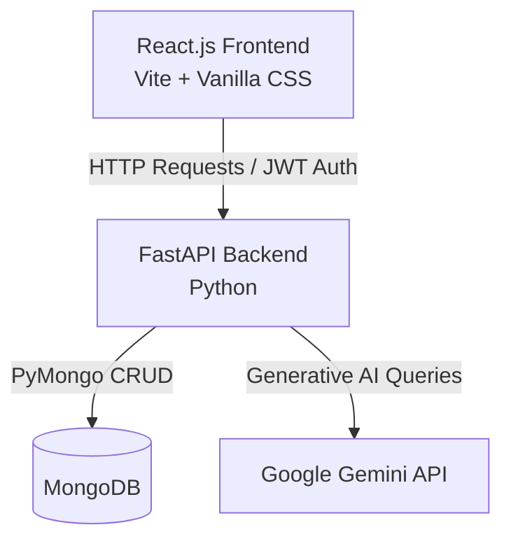

# 🎓 StudyAI: AI-Powered Personal Tutor & Learning Coach

StudyAI is a feature-rich, full-stack educational web application that acts as a personal AI tutor. It enables students to chat with specialized subject tutors, generate custom quizzes with automatic grading and AI feedback, create study flashcards, and explain code snippets.

---

## 🏗️ Architecture & Tech Stack

StudyAI is built on a modern, decoupled client-server architecture:



### 💻 Frontend (Client Side)
- **Framework:** React.js (bootstrapped with Vite for instant hot-reloading).
- **Styling:** Vanilla CSS (curated modern layout, responsive sidebar navigation, dark/light theme accents, glassmorphic UI cards, and micro-interactions).
- **State Management:** React Hooks (`useState`, `useEffect`) and `localStorage` to manage sessions, fallback client-side storage, and guest states.
- **Routing:** Conditional component view rendering (`Dashboard`, `Chat`, `Quizzes`, `Flashcards`, `Code Explainer`, and `AuthPortal`).

### ⚙️ Backend (Server Side)
- **Framework:** FastAPI (Python-based, high performance, asynchronous support, automatically generated documentation).
- **Authentication:** Stateful JWT token validation (via `PyJWT`) and password encryption (via `bcrypt`).
- **Database:** MongoDB (managed via `pymongo` with robust offline fallback modes).
- **AI Integration:** Google Gemini API (`google-generativeai` SDK).

---

## 🌟 Core Features

### 1. Subject-Specialized AI Tutors
Chat sessions support 5 distinct tutor personas using custom system instructions:
- **Sigma (Math Specialist):** Step-by-step logical explanations utilizing LaTeX notation ($...$ and $$...$$) for clear equation typesetting.
- **Newton (Science Guru):** Visualizes biology, physics, and chemistry concepts with real-world analogies.
- **Athena (History Guide):** Connects past events chronologically using markdown-styled timelines.
- **Ada (Coding Coach):** Breaks down algorithms, lists Big-O time/space complexity, and outputs clean code blocks.
- **General Tutor:** Guides students using interactive Socratic questioning.

### 2. Custom Quiz Generator & AI Grading
- Generates multiple-choice quizzes (MCQs) on any topic and difficulty level (Easy, Medium, Hard).
- Utilizes Gemini's JSON MIME-type capability to guarantee structured API responses.
- Evaluates user answers and provides overall scores alongside detailed feedback on conceptual mistakes.

### 3. Smart Flashcard Generator
- Creates educational study decks on any subject with clean front/back card formats for memorization.

### 4. Interactive Code Explainer
- Explains snippets in detail, analyzes time and space complexities, and refactors code based on clean coding standards.

### 5. Multi-User Authentication & Guest Portal
- Secure Signup and Login.
- **Local Guest Mode:** Allows students to run the app locally without requiring a database connection, storing sessions in local memory.

---

## 🚀 Step-by-Step Installation & Run Guide

### 1. Backend Setup
Navigate to the `backend` folder:
```bash
cd backend
```
Create a virtual environment and activate it:
```bash
python -m venv venv
# On Windows:
venv\Scripts\activate
```
Install dependencies:
```bash
pip install -r requirements.txt
```
Create a `.env` file in the `backend/` folder:
```env
MONGODB_URI=mongodb://localhost:27017
DB_NAME=studyai
GEMINI_API_KEY=your_gemini_api_key_here
GEMINI_MODEL=gemini-2.0-flash-lite
JWT_SECRET=your_jwt_secret_key
```
Run the backend:
```bash
python main.py
```

### 2. Frontend Setup
Navigate to the `frontend` folder:
```bash
cd ../frontend
```
Install npm packages:
```bash
npm install
```
Configure `.env` in the `frontend/` folder:
```env
VITE_API_BASE_URL=http://localhost:8000
```
Run the React development server:
```bash
npm run dev
```

---

## 🎓 VIVA & DEFENSE STUDY CHEAT SHEET
*Be ready for any technical questions from the examiners with these common Q&As:*

### 🔍 System Design & Architecture
| Question | Best Answer |
| :--- | :--- |
| **Why did you choose FastAPI over Flask or Django?** | **FastAPI** is much faster than Flask/Django due to its asynchronous runtime. It supports automatic data validation out of the box using **Pydantic** and auto-generates interactive API docs (Swagger/OpenAPI), making frontend integration seamless. |
| **Why MongoDB (NoSQL) instead of SQL (MySQL/PostgreSQL)?** | Learning data (chats, quizzes, flashcards) is naturally hierarchical and flexible. MongoDB's document model allows us to store conversation threads as dynamic arrays of JSON messages without performing expensive SQL joins. |
| **How does the system connect to MongoDB?** | We use `pymongo` with a connection timeout check (`ping` command). If MongoDB is offline, the app handles this gracefully (logs the failure) and switches to an **offline guest fallback**, ensuring the application remains functional. |

### 🧠 Generative AI & Gemini API
| Question | Best Answer |
| :--- | :--- |
| **How do you guarantee that Gemini outputs valid JSON for Quizzes/Flashcards?** | We use Gemini's structured output config: `generation_config={"response_mime_type": "application/json"}`. This forces the model to respond in raw JSON matching our schema guidelines, which we then safely parse using `json.loads()`. |
| **What happens if the Gemini API model fails or experiences rate limits?** | We implemented a **fallback chain mechanism**. The code maintains an array of prioritized models (`gemini-2.0-flash-lite`, `gemini-2.0-flash`, `gemini-2.5-flash`, etc.). If one model triggers a quota limit, the backend automatically retries the request using the next available fallback model. |
| **How do you restrict the AI's behavior to acting like a teacher?** | We configure system instructions (`system_instruction`) upon initializing `GenerativeModel`. This locks the model's persona (e.g., instructing Athena to act as a historical storyteller or Sigma to output math concepts in LaTeX). |

### 🔒 Security & Data Flow
| Question | Best Answer |
| :--- | :--- |
| **How is password security handled?** | We never store plain text passwords. We hash them using the industry-standard **bcrypt** library, which incorporates salt to prevent rainbow table attacks. |
| **How do you manage authenticated user sessions?** | We use **JWT (JSON Web Tokens)**. When a user logs in, the backend signs a token containing the `user_id`. The client stores it in `localStorage` and sends it inside the HTTP `Authorization` header (`Bearer <token>`) for subsequent requests. FastAPI decodes and validates this token. |
| **What is CORS and why did you add CORSMiddleware?** | **Cross-Origin Resource Sharing (CORS)** is a browser security feature. Since the React app runs on port `5173` and the API runs on `8000`, the browser blocks API calls unless the backend explicitly allows port `5173` origins. We configured `CORSMiddleware` to whitelist communication. |